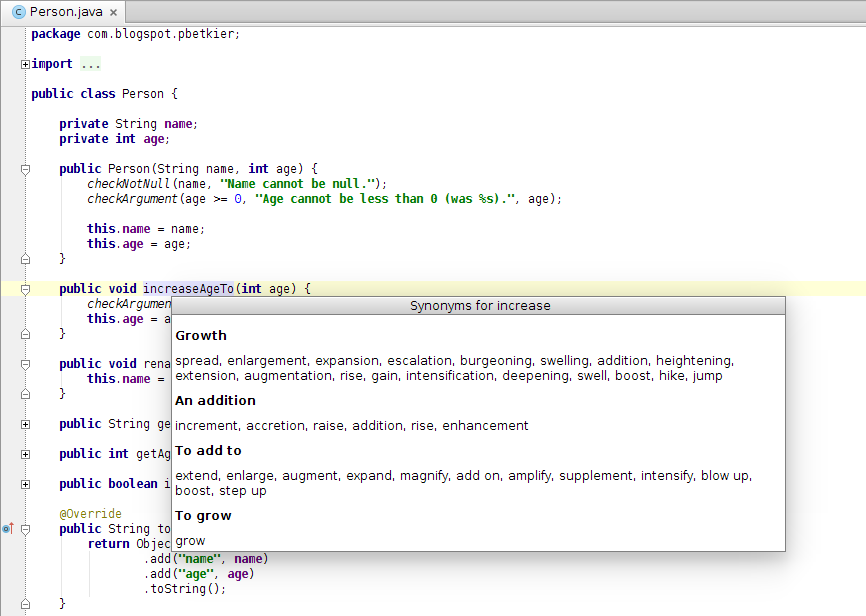

# IntelliJ Synonyms [](https://travis-ci.org/pbetkier/intellij-synonyms)

*View synonyms for the word under cursor*

Naming things is one of the hardest tasks in software development. Don't you hate it when you model your domain or an
algorithm and feel the term you came up with doesn't fully express your concept? If only somebody gave you a list of 
alternatives to pick from...

That's what IntelliJ Synonyms plugin does. It helps you find the right term for your concept by presenting a 
list of synonyms for the word under the cursor in your editor.

## Installation

You can install IntelliJ Synonyms using the standard channel - the **Plugins** IDE settings. It is uploaded to
JetBrains Plugins Repository, so you can view the details [here](https://plugins.jetbrains.com/plugin/7576).

Requires IntelliJ IDEA 13.1 or greater. Confirmed working with PyCharm 3.4 as well.

## Usage

In your editor, move your cursor to the word you are interested in, which can be a part of an identifier, and call
*Show synonyms* action - either from the **View** menu or using the **Alt+Y** shortcut. You will see a list of synonyms 
for the word categorized by its senses.



Currently only words of length greater than 3 are searchable.

## Development

Clone this repository and import in your IntelliJ as a Gradle Project to get the required dependencies. 
Configure IntelliJ SDK according to [getting started guide](http://confluence.jetbrains.com/display/IDEADEV/Getting+Started+with+Plugin+Development).

In order to run the tests from the command line, create a symlink in the project root called ``idea-libs`` linking to 
your IntelliJ's ``lib/`` subdirectory. Then execute ``./gradlew test``.

### Synonyms source

Synonyms are queried from [http://www.wordreference.com/thesaurus](http://www.wordreference.com/thesaurus) service and
scraped from an HTML response.

## License

```
Copyright (C) 2014 Piotr Betkier

Licensed under the Apache License, Version 2.0 (the "License");
you may not use this file except in compliance with the License.
You may obtain a copy of the License at

    http://www.apache.org/licenses/LICENSE-2.0      

Unless required by applicable law or agreed to in writing, software
distributed under the License is distributed on an "AS IS" BASIS,
WITHOUT WARRANTIES OR CONDITIONS OF ANY KIND, either express or implied.
See the License for the specific language governing permissions and
limitations under the License.
```
